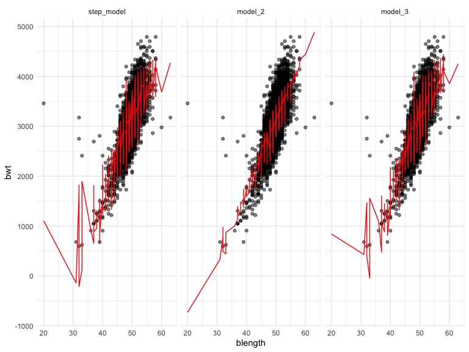
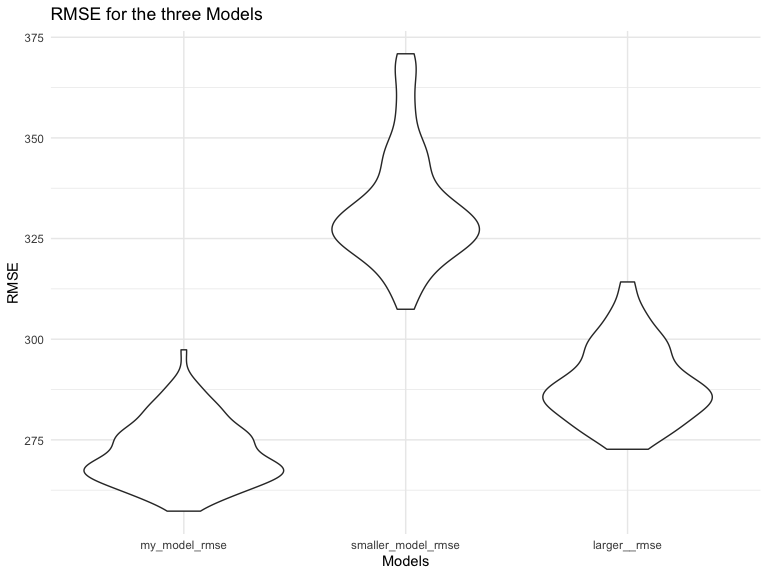
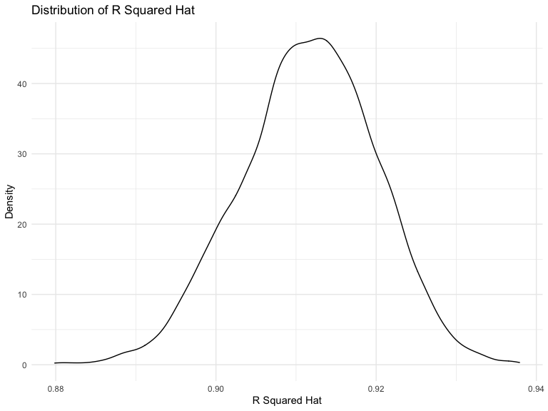
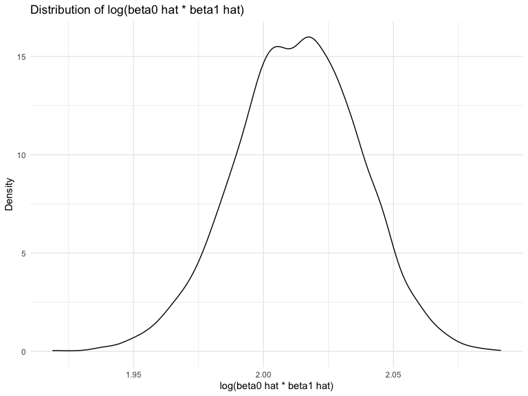

p8105\_hw6\_cl4044
================
Chenxi Liu
12/7/2020

``` r
library(tidyverse)
library(modelr)
library(p8105.datasets)
```

### Problem 1

``` r
homicide_df = 
  read_csv("data/homicide-data.csv", na = c("", "NA", "Unknown")) %>% 
  mutate(
    city_state = str_c(city, state, sep = ", "),
    victim_age = as.numeric(victim_age),
    resolution = case_when(
      disposition == "Closed without arrest" ~ 0,
      disposition == "Open/No arrest"        ~ 0,
      disposition == "Closed by arrest"      ~ 1)
  ) %>% 
  filter(
    victim_race %in% c("White", "Black"),
    city_state != "Tulsa, AL") %>% 
  select(city_state, resolution, victim_age, victim_race, victim_sex)
```

    ## Parsed with column specification:
    ## cols(
    ##   uid = col_character(),
    ##   reported_date = col_double(),
    ##   victim_last = col_character(),
    ##   victim_first = col_character(),
    ##   victim_race = col_character(),
    ##   victim_age = col_double(),
    ##   victim_sex = col_character(),
    ##   city = col_character(),
    ##   state = col_character(),
    ##   lat = col_double(),
    ##   lon = col_double(),
    ##   disposition = col_character()
    ## )

Start with one city.

``` r
baltimore_df =
  homicide_df %>% 
  filter(city_state == "Baltimore, MD")
glm(resolution ~ victim_age + victim_race + victim_sex, 
    data = baltimore_df,
    family = binomial()) %>% 
  broom::tidy() %>% 
  mutate(
    OR = exp(estimate),
    CI_lower = exp(estimate - 1.96 * std.error),
    CI_upper = exp(estimate + 1.96 * std.error)
  ) %>% 
  select(term, OR, starts_with("CI")) %>% 
  knitr::kable(digits = 3)
```

| term              |    OR | CI\_lower | CI\_upper |
| :---------------- | ----: | --------: | --------: |
| (Intercept)       | 1.363 |     0.975 |     1.907 |
| victim\_age       | 0.993 |     0.987 |     1.000 |
| victim\_raceWhite | 2.320 |     1.648 |     3.268 |
| victim\_sexMale   | 0.426 |     0.325 |     0.558 |

Try this across cities.

``` r
models_results_df = 
  homicide_df %>% 
  nest(data = -city_state) %>% 
  mutate(
    models = 
      map(.x = data, ~glm(resolution ~ victim_age + victim_race + victim_sex, data = .x, family = binomial())),
    results = map(models, broom::tidy)
  ) %>% 
  select(city_state, results) %>% 
  unnest(results) %>% 
  mutate(
    OR = exp(estimate),
    CI_lower = exp(estimate - 1.96 * std.error),
    CI_upper = exp(estimate + 1.96 * std.error)
  ) %>% 
  select(city_state, term, OR, starts_with("CI")) 
```

``` r
models_results_df %>% 
  filter(term == "victim_sexMale") %>% 
  mutate(city_state = fct_reorder(city_state, OR)) %>% 
  ggplot(aes(x = city_state, y = OR)) + 
  geom_point() + 
  geom_errorbar(aes(ymin = CI_lower, ymax = CI_upper)) + 
  theme(axis.text.x = element_text(angle = 90, hjust = 1))
```


## Problem 2

Import and tidy the dataset

``` r
baby_df = 
  read_csv("./data/birthweight.csv") %>%
  janitor::clean_names() %>%
  mutate(
    across(
      .cols = c("frace", "mrace"),
      ~ case_when(
        .x == 1 ~ "White",
        .x == 2 ~ "Black",
        .x == 3 ~ "Asian",
        .x == 4 ~ "Puero Rican",
        .x == 8 ~ "Other",
        .x == 9 ~ "Unknown"
        )
    ),
    across(where(is.character), as.factor)
    ) %>%
  mutate(
    babysex = case_when(
      babysex == 1 ~ "male",
      babysex == 2 ~ "female"
      ), 
     malform = case_when(malform == 0~"absent", 
                         malform == 1 ~ "present"),
    across(where(is.character), as.factor)
  )
```

    ## Parsed with column specification:
    ## cols(
    ##   .default = col_double()
    ## )

    ## See spec(...) for full column specifications.

Stepwise regression model

``` r
full_model = lm(bwt ~ ., data = baby_df) 
step_model <- MASS::stepAIC(full_model, direction = "both", 
                      trace = FALSE)
step_model %>% 
  broom::tidy() %>% 
  knitr::kable(digits = 3)
```

| term             |   estimate | std.error | statistic | p.value |
| :--------------- | ---------: | --------: | --------: | ------: |
| (Intercept)      | \-6145.151 |   141.950 |  \-43.291 |   0.000 |
| babysexmale      |   \-28.558 |     8.455 |   \-3.378 |   0.001 |
| bhead            |    130.777 |     3.447 |    37.944 |   0.000 |
| blength          |     74.947 |     2.019 |    37.120 |   0.000 |
| delwt            |      4.107 |     0.392 |    10.475 |   0.000 |
| fincome          |      0.318 |     0.175 |     1.820 |   0.069 |
| gaweeks          |     11.592 |     1.462 |     7.929 |   0.000 |
| mheight          |      6.594 |     1.785 |     3.694 |   0.000 |
| mraceBlack       |   \-63.906 |    42.366 |   \-1.508 |   0.132 |
| mracePuero Rican |   \-25.791 |    45.350 |   \-0.569 |   0.570 |
| mraceWhite       |     74.887 |    42.315 |     1.770 |   0.077 |
| parity           |     96.305 |    40.336 |     2.388 |   0.017 |
| ppwt             |    \-2.676 |     0.427 |   \-6.261 |   0.000 |
| smoken           |    \-4.843 |     0.586 |   \-8.271 |   0.000 |

Plot prediction values vs. residuals

``` r
baby_df %>% 
  modelr::add_residuals(step_model) %>% 
  modelr::add_predictions(step_model) %>%
  ggplot(aes(x = pred, y = resid)) + 
  geom_point(alpha = 0.3) +
  labs(
    title = "Predicton vs. Residual",
    x = "Predicton",
    y = "Residual"
  )
```


According to the plot above, most of the points are clustered around
zero. There are some large residual points when the prediction value is
under 1000.

Model 2: One using length at birth and gestational age as predictors
(main effects only)

``` r
model_2 = lm(bwt ~ blength + gaweeks, data = baby_df)

model_2 %>%
  broom::tidy() %>% 
  knitr::kable(digits = 3)
```

| term        |   estimate | std.error | statistic | p.value |
| :---------- | ---------: | --------: | --------: | ------: |
| (Intercept) | \-4347.667 |    97.958 |  \-44.383 |       0 |
| blength     |    128.556 |     1.990 |    64.604 |       0 |
| gaweeks     |     27.047 |     1.718 |    15.744 |       0 |

Model 3: One using head circumference, length, sex, and all interactions
(including the three-way interaction) between these.

``` r
model_3 = lm(bwt ~ bhead * blength * babysex, data = baby_df) 
model_3 %>%
  broom::tidy() %>% 
  knitr::kable(digits = 3)
```

| term                      |   estimate | std.error | statistic | p.value |
| :------------------------ | ---------: | --------: | --------: | ------: |
| (Intercept)               |  \-801.949 |  1102.308 |   \-0.728 |   0.467 |
| bhead                     |   \-16.598 |    34.092 |   \-0.487 |   0.626 |
| blength                   |   \-21.646 |    23.372 |   \-0.926 |   0.354 |
| babysexmale               | \-6374.868 |  1677.767 |   \-3.800 |   0.000 |
| bhead:blength             |      3.324 |     0.713 |     4.666 |   0.000 |
| bhead:babysexmale         |    198.393 |    51.092 |     3.883 |   0.000 |
| blength:babysexmale       |    123.773 |    35.119 |     3.524 |   0.000 |
| bhead:blength:babysexmale |    \-3.878 |     1.057 |   \-3.670 |   0.000 |

``` r
baby_df %>% 
  gather_predictions(step_model, model_2, model_3) %>% 
  mutate(model = fct_inorder(model)) %>% 
  ggplot(aes(x = blength, y = bwt)) + 
  geom_point(alpha = .5) +
  geom_line(aes(y = pred), color = "red") + 
  facet_grid(~model)
```



It’s not clear, which is best.

Compare three models in terms of the cross-validated prediction error.

``` r
cv_df =
  crossv_mc(baby_df, 100) %>% 
  mutate(
    train = map(train, as_tibble),
    test = map(test, as_tibble))

cv_res = 
  cv_df %>%
  mutate(
      my_model = map(train, ~step_model),
      smaller_model = map(train, ~lm(bwt ~ blength + gaweeks, data = .x)),
      larger_model = map(train, ~lm(bwt ~ bhead * blength * babysex, data = .x))
  ) %>%
  mutate(
      my_model_rmse = 
        map2_dbl(my_model, test, ~rmse(model = .x, data = .y)),
      smaller_model_rmse = 
        map2_dbl(smaller_model, test, ~rmse(model = .x, data = .y)),
      larger__rmse = 
        map2_dbl(larger_model, test, ~rmse(model = .x, data = .y))
  )

cv_res %>% 
  select(ends_with("rmse")) %>% 
  pivot_longer(
    everything(),
    names_to = "model", 
    values_to = "rmse",
    names_prefix = "rmse_") %>% 
  mutate(model = fct_inorder(model)) %>% 
  ggplot(aes(x = model, y = rmse)) + geom_violin() +
  labs(
    title = "RMSE for the three Models",
    x = "Models",
    y = "RMSE"
  )
```



According to the graph above, my model has the lowest RMSE and,
therefore, could potentially be the best out of three.

## Problem 3

Load the dataset

``` r
weather_df = 
  rnoaa::meteo_pull_monitors(
    c("USW00094728"),
    var = c("PRCP", "TMIN", "TMAX"), 
    date_min = "2017-01-01",
    date_max = "2017-12-31") %>%
  mutate(
    name = recode(id, USW00094728 = "CentralPark_NY"),
    tmin = tmin / 10,
    tmax = tmax / 10) %>%
  select(name, id, everything())
```

    ## Registered S3 method overwritten by 'hoardr':
    ##   method           from
    ##   print.cache_info httr

    ## using cached file: /Users/chenxiliu/Library/Caches/R/noaa_ghcnd/USW00094728.dly

    ## date created (size, mb): 2020-10-06 19:59:58 (7.522)

    ## file min/max dates: 1869-01-01 / 2020-10-31

Bootstrap 5000 times

``` r
set.seed(123)
bootstrap_results =
  weather_df %>% 
  modelr::bootstrap(n = 5000) %>% 
  mutate(
    models = map(strap, ~lm(tmax ~ tmin, data = .x) ),
    results_glance = map(models, broom::glance),
    results_tidy = map(models, broom::tidy)
    ) %>% 
  unnest(results_glance, results_tidy) %>%
  select(id = .id, term, estimate, r.squared)

bootstrap_results %>% 
  group_by(term) %>% 
  summarize(boot_mean = mean(estimate),
            boot_se = sd(estimate),
            r_squared_mean = mean(r.squared),
            r_squared_sd = sd(r.squared)) %>% 
  knitr::kable(digits = 3)
```

    ## `summarise()` ungrouping output (override with `.groups` argument)

| term        | boot\_mean | boot\_se | r\_squared\_mean | r\_squared\_sd |
| :---------- | ---------: | -------: | ---------------: | -------------: |
| (Intercept) |      7.208 |    0.254 |            0.912 |          0.008 |
| tmin        |      1.039 |    0.017 |            0.912 |          0.008 |

The table above showed the mean of the estimate, the standard deviation
of the estimate, and the mean of rsquared after bootstrap 5000 times.

Plot the distribution graph of r^2.

``` r
bootstrap_results %>% 
  ggplot(aes(x = r.squared)) +
  geom_density() +
  labs(
    title = "Distribution of R Squared Hat",
    x = "R Squared Hat",
    y = "Density"
  )
```



The distribution of r^2 is approximately normal, with the mean 0.912 and
the standard error of 0.008.

Plot the distribution graph of log(beta0 hat \* beta1 hat).

``` r
bootstrap_results_log =
  bootstrap_results %>% 
  mutate(term = recode(term, '(Intercept)' = 'intercept')) %>%
  pivot_wider(names_from = term, values_from = estimate) %>%
  mutate(log_coef_intereaction = log(intercept*tmin))

bootstrap_results_log %>%
  ggplot(aes(x = log_coef_intereaction)) +
  geom_density() +
  labs(
    title = "Distribution of log(beta0 hat * beta1 hat)",
    x = "log(beta0 hat * beta1 hat)",
    y = "Density"
  )
```



``` r
bootstrap_results_log %>%
  summarize(intersection_mean = mean(log_coef_intereaction),
            intersection_se = sd(log_coef_intereaction)) %>%
  knitr::kable(digits = 3)
```

| intersection\_mean | intersection\_se |
| -----------------: | ---------------: |
|              2.013 |            0.024 |

The distribution of log(beta0 hat \* beta1 hat) is approximately normal,
with the mean 2.013 and the standard error of 0.024.

Using the 5000 bootstrap estimates, identify the 2.5% and 97.5%
quantiles to provide a 95% confidence interval for r^2 and log(beta0 hat
\* beta1 hat):

``` r
tibble(
  quantile = c("2.5 %", "97.5 %"),
  'r.squared' = quantile(bootstrap_results_log$r.squared, c(0.025,0.975)),
  'log.muti.beta' = quantile(bootstrap_results_log$log_coef_intereaction, c(0.025,0.975))
) %>%
   knitr::kable(digits = 3)
```

| quantile | r.squared | log.muti.beta |
| :------- | --------: | ------------: |
| 2.5 %    |     0.895 |         1.964 |
| 97.5 %   |     0.927 |         2.058 |

The 95% confidence interval for r^2 is 0.8945701, 0.9271042.

The 95% confidence interval for log(beta0 hat \* beta1 hat) is
1.9641656, 2.0583636.
