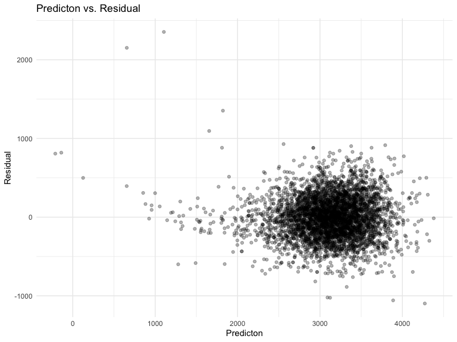

p8105\_hw6\_cl4044
================
Chenxi Liu
12/7/2020

``` r
library(tidyverse)
library(modelr)
library(p8105.datasets)
```

### Problem 1

``` r
homicide_df = 
  read_csv("data/homicide-data.csv", na = c("", "NA", "Unknown")) %>% 
  mutate(
    city_state = str_c(city, state, sep = ", "),
    victim_age = as.numeric(victim_age),
    resolution = case_when(
      disposition == "Closed without arrest" ~ 0,
      disposition == "Open/No arrest"        ~ 0,
      disposition == "Closed by arrest"      ~ 1)
  ) %>% 
  filter(
    victim_race %in% c("White", "Black"),
    city_state != "Tulsa, AL") %>% 
  select(city_state, resolution, victim_age, victim_race, victim_sex)
```

    ## Parsed with column specification:
    ## cols(
    ##   uid = col_character(),
    ##   reported_date = col_double(),
    ##   victim_last = col_character(),
    ##   victim_first = col_character(),
    ##   victim_race = col_character(),
    ##   victim_age = col_double(),
    ##   victim_sex = col_character(),
    ##   city = col_character(),
    ##   state = col_character(),
    ##   lat = col_double(),
    ##   lon = col_double(),
    ##   disposition = col_character()
    ## )

Start with one city.

``` r
baltimore_df =
  homicide_df %>% 
  filter(city_state == "Baltimore, MD")
glm(resolution ~ victim_age + victim_race + victim_sex, 
    data = baltimore_df,
    family = binomial()) %>% 
  broom::tidy() %>% 
  mutate(
    OR = exp(estimate),
    CI_lower = exp(estimate - 1.96 * std.error),
    CI_upper = exp(estimate + 1.96 * std.error)
  ) %>% 
  select(term, OR, starts_with("CI")) %>% 
  knitr::kable(digits = 3)
```

| term              |    OR | CI\_lower | CI\_upper |
| :---------------- | ----: | --------: | --------: |
| (Intercept)       | 1.363 |     0.975 |     1.907 |
| victim\_age       | 0.993 |     0.987 |     1.000 |
| victim\_raceWhite | 2.320 |     1.648 |     3.268 |
| victim\_sexMale   | 0.426 |     0.325 |     0.558 |

Try this across cities.

``` r
models_results_df = 
  homicide_df %>% 
  nest(data = -city_state) %>% 
  mutate(
    models = 
      map(.x = data, ~glm(resolution ~ victim_age + victim_race + victim_sex, data = .x, family = binomial())),
    results = map(models, broom::tidy)
  ) %>% 
  select(city_state, results) %>% 
  unnest(results) %>% 
  mutate(
    OR = exp(estimate),
    CI_lower = exp(estimate - 1.96 * std.error),
    CI_upper = exp(estimate + 1.96 * std.error)
  ) %>% 
  select(city_state, term, OR, starts_with("CI")) 
```

``` r
models_results_df %>% 
  filter(term == "victim_sexMale") %>% 
  mutate(city_state = fct_reorder(city_state, OR)) %>% 
  ggplot(aes(x = city_state, y = OR)) + 
  geom_point() + 
  geom_errorbar(aes(ymin = CI_lower, ymax = CI_upper)) + 
  theme(axis.text.x = element_text(angle = 90, hjust = 1))
```


## Problem 2

Import and tidy the dataset

``` r
baby_df = 
  read_csv("./data/birthweight.csv") %>%
  janitor::clean_names() %>%
  mutate(
    across(
      .cols = c("frace", "mrace"),
      ~ case_when(
        .x == 1 ~ "White",
        .x == 2 ~ "Black",
        .x == 3 ~ "Asian",
        .x == 4 ~ "Puero Rican",
        .x == 8 ~ "Other",
        .x == 9 ~ "Unknown"
        )
    ),
    across(where(is.character), as.factor)
    ) %>%
  mutate(
    babysex = case_when(
      babysex == 1 ~ "male",
      babysex == 2 ~ "female"
      ), 
     malform = case_when(malform == 0~"absent", 
                         malform == 1 ~ "present"),
    across(where(is.character), as.factor)
  )
```

    ## Parsed with column specification:
    ## cols(
    ##   .default = col_double()
    ## )

    ## See spec(...) for full column specifications.

fit a model

``` r
full_model = lm(bwt ~ ., data = baby_df) 
step_model <- MASS::stepAIC(full_model, direction = "both", 
                      trace = FALSE)
summary(step_model)
```

    ## 
    ## Call:
    ## lm(formula = bwt ~ babysex + bhead + blength + delwt + fincome + 
    ##     gaweeks + mheight + mrace + parity + ppwt + smoken, data = baby_df)
    ## 
    ## Residuals:
    ##      Min       1Q   Median       3Q      Max 
    ## -1097.18  -185.52    -3.39   174.14  2353.44 
    ## 
    ## Coefficients:
    ##                    Estimate Std. Error t value Pr(>|t|)    
    ## (Intercept)      -6145.1507   141.9496 -43.291  < 2e-16 ***
    ## babysexmale        -28.5580     8.4549  -3.378 0.000737 ***
    ## bhead              130.7770     3.4466  37.944  < 2e-16 ***
    ## blength             74.9471     2.0190  37.120  < 2e-16 ***
    ## delwt                4.1067     0.3921  10.475  < 2e-16 ***
    ## fincome              0.3180     0.1747   1.820 0.068844 .  
    ## gaweeks             11.5925     1.4621   7.929 2.79e-15 ***
    ## mheight              6.5940     1.7849   3.694 0.000223 ***
    ## mraceBlack         -63.9057    42.3663  -1.508 0.131523    
    ## mracePuero Rican   -25.7914    45.3502  -0.569 0.569578    
    ## mraceWhite          74.8868    42.3146   1.770 0.076837 .  
    ## parity              96.3047    40.3362   2.388 0.017004 *  
    ## ppwt                -2.6756     0.4274  -6.261 4.20e-10 ***
    ## smoken              -4.8434     0.5856  -8.271  < 2e-16 ***
    ## ---
    ## Signif. codes:  0 '***' 0.001 '**' 0.01 '*' 0.05 '.' 0.1 ' ' 1
    ## 
    ## Residual standard error: 272.3 on 4328 degrees of freedom
    ## Multiple R-squared:  0.7181, Adjusted R-squared:  0.7173 
    ## F-statistic: 848.1 on 13 and 4328 DF,  p-value: < 2.2e-16

``` r
baby_df %>% 
  modelr::add_residuals(step_model) %>% 
  ggplot(aes(x = gaweeks, y = resid)) + 
  geom_point()
```



## Problem 3

Import the dataset

``` r
weather_df = 
  rnoaa::meteo_pull_monitors(
    c("USW00094728"),
    var = c("PRCP", "TMIN", "TMAX"), 
    date_min = "2017-01-01",
    date_max = "2017-12-31") %>%
  mutate(
    name = recode(id, USW00094728 = "CentralPark_NY"),
    tmin = tmin / 10,
    tmax = tmax / 10) %>%
  select(name, id, everything())
```

    ## Registered S3 method overwritten by 'hoardr':
    ##   method           from
    ##   print.cache_info httr

    ## using cached file: /Users/chenxiliu/Library/Caches/R/noaa_ghcnd/USW00094728.dly

    ## date created (size, mb): 2020-10-06 19:59:58 (7.522)

    ## file min/max dates: 1869-01-01 / 2020-10-31
